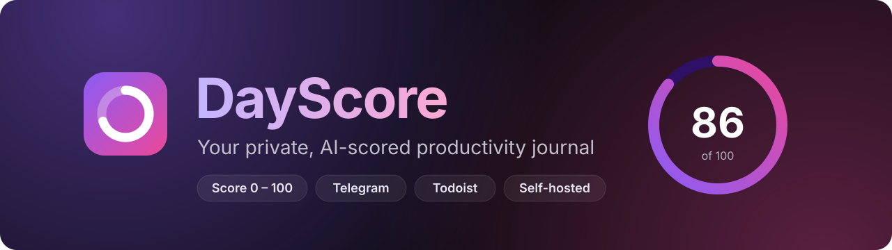
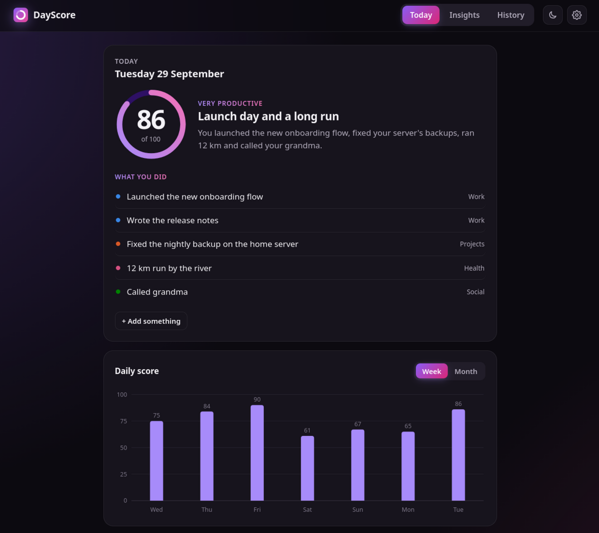
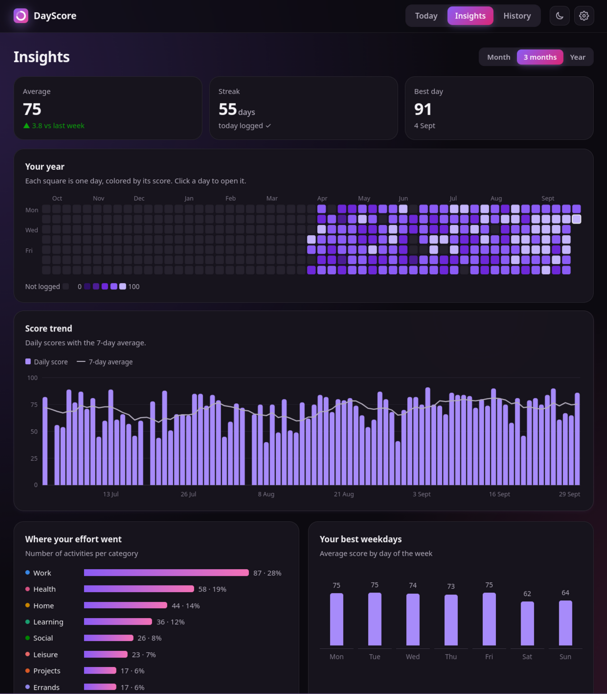
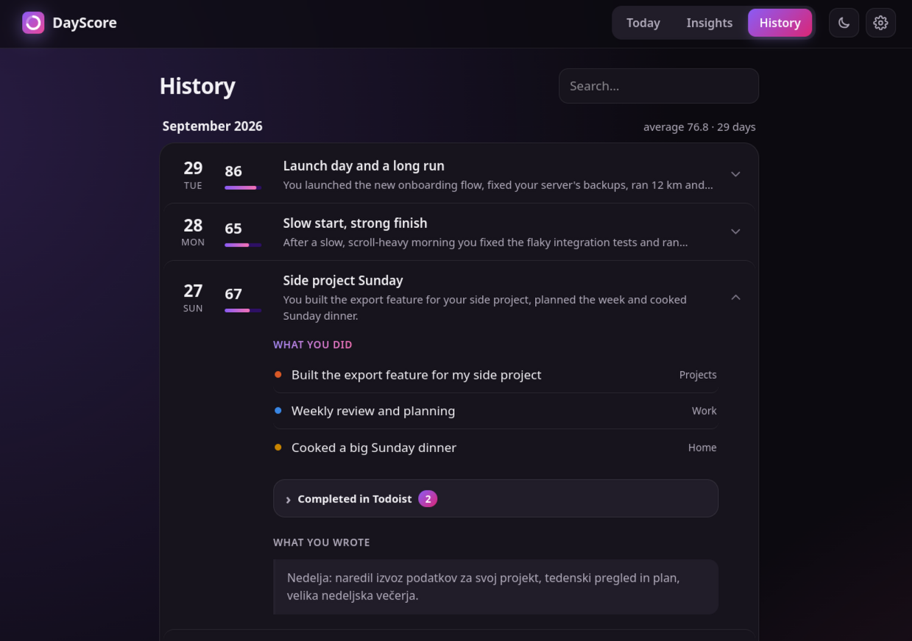
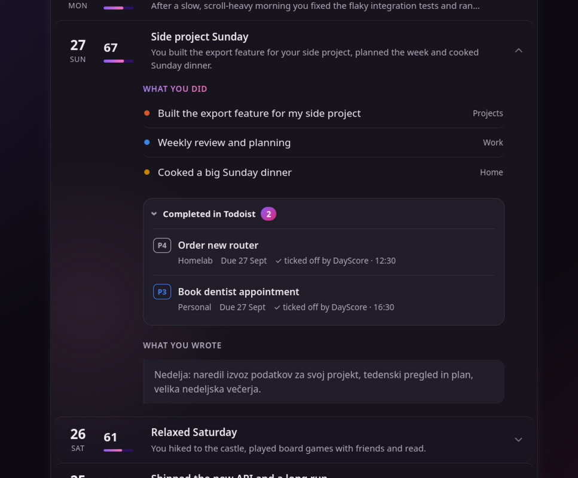
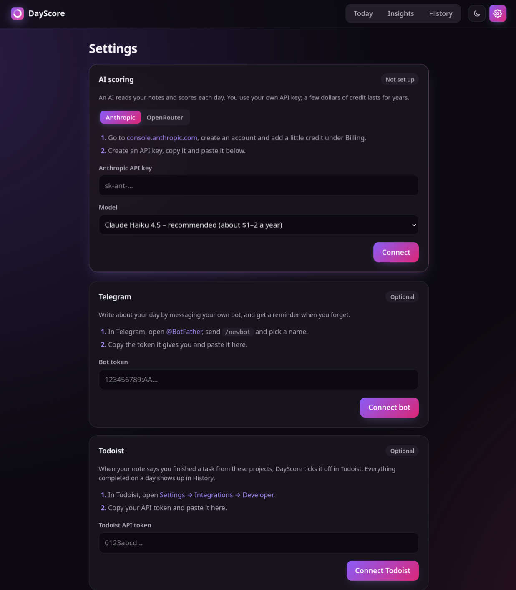
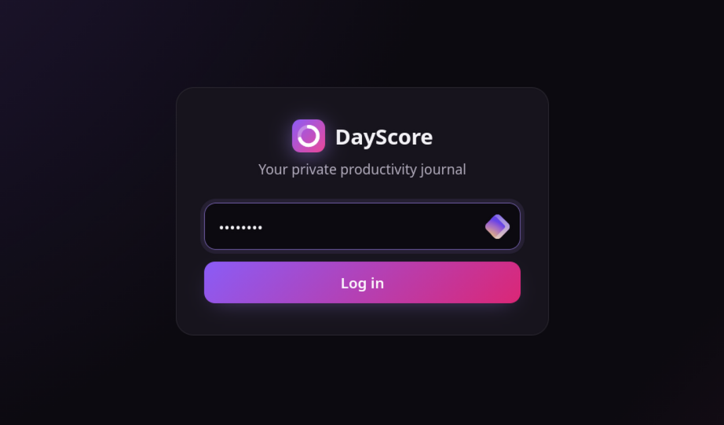

<p align="center">
  
</p>

<p align="center">
  <a href="https://github.com/BVrabec/DayScore/actions/workflows/ci.yml"></a>
  <a href="https://github.com/BVrabec/DayScore/releases"></a>
  <a href="LICENSE"></a>
  
  
  
</p>

**DayScore** is a small, self-hosted journal that turns a few words about your day into a
**productivity score from 0 to 100**. Every evening you write what you got done, in the
browser or as a Telegram message, in any language. An AI reads it, scores the day, lists what you
did and keeps your history. Over time you see your streaks, your trends and where your effort
really goes.

It runs on your own hardware (a Proxmox container, a small VM, a Raspberry Pi…), stores
everything in one **encrypted** local file, and only you can sign in. Use a cloud AI with your
own key, or **your own AI server** so your journal never leaves your network.

<p align="center">
  
</p>

## Who it's for

- You want a **daily check-in habit** that takes 30 seconds, not a complicated planner.
- You like **seeing progress**: streaks, weekly and monthly averages, a year calendar.
- You want an honest score that knows **scrolling isn't work, but rest and chores count**.
- You care about **privacy** and prefer to self-host instead of giving your diary to a cloud app.

## Features

**✍️ Log your day your way**
- Write in the browser, or just **message your own Telegram bot**. Both go into the same day.
- Add more during the day; the day is re-scored with everything you wrote.
- Forgot yesterday? You can still log it the next morning (until noon by default).
- Write in **any language**; the results are always in English.
- Add an optional **mood** (five faces) and **edit or delete** any day later.

**🧠 AI score from 0 to 100**
- A consistent rubric: hard or long tasks count more, finishing beats starting, rest days
  aren't failures, doomscrolling pulls the score down.
- **Standout days get standout scores**: launching or finishing something big, or doing
  something new for you, lands in the 90s, while an ordinary evening of drifting stays around 50.
- **Knows your workdays**: what you get done after work counts extra, and one long, focused
  evening on a project can be a great day even if it's the only thing you did.
- **Fixed scale**: a 70 means the same next year as today. Every day shows **why** it got its
  score, plus one tip for tomorrow. The chart marks the day you switch AI models.
- Tell it **what matters to you** ("I'm studying for exams", "less phone time") and it adapts.
- Use **Anthropic** (Claude), **OpenRouter** (Claude, Gemini, DeepSeek and many more), or
  **your own server** with [Ollama](https://ollama.com), LM Studio or any OpenAI-compatible API.
  With a cloud model, one note a day costs roughly **$0.25–3 per year**.

**📊 Insights and history**
- Average, streak and best day, plus a GitHub-style **year calendar**.
- Score trends (month, 3 months, year), **where your effort went** by category, and your best weekdays.
- A searchable **history** of every day: what you did, and exactly what you wrote.

**✅ Todoist integration (optional)**
- Pick the projects to watch. When your note says you finished a task, DayScore suggests
  ticking it off. You confirm with one tap on the website or in Telegram (or let it tick
  them off automatically).
- Say "tomorrow I have to…" in your note and the task lands in your **Todoist Inbox**, with a
  due date.
- History shows, per day, the tasks DayScore ticked off (priority, project, due date,
  labels, description) and the tasks it added.
- Unfinished tasks that were due that day can lower the score a little.

**🔔 Telegram bot (optional)**
- `/today`, `/yesterday`, `/week`, `/stats`, gentle reminders in the morning or evening
  if you forgot to log, and a **weekly summary** on Sunday evening.
- Linked to your account with a one-time code; it ignores everyone else.

**💾 Backups and restore**
- Scheduled, compressed, **always encrypted** backups to a folder or NAS, an SMB share,
  WebDAV/Nextcloud, S3-compatible storage, or Google Drive, Dropbox and OneDrive.
- Keeps 7 daily, 4 weekly and 6 monthly copies, skips days with no changes, and tells you on
  Telegram if a backup fails.
- Restore in Settings with a preview first and a safety copy of your current data, or
  straight onto a fresh install from the first-run page.

**🔒 Private by design**
- **Encrypted on disk** (SQLCipher, AES-256): someone who copies the data volume sees nothing.
- Single user, password login, optional **two-factor codes** (authenticator app) with recovery codes.
- Changing where your data goes (AI, Telegram, Todoist, backups) asks for your password again.
- Lockout after repeated failed logins, "sign out everywhere", and no telemetry. See
  [what leaves your server](#what-leaves-your-server).

**🎨 Pleasant to use**
- A modern dark theme (light theme too), works on phones, and can be installed as an app
  on your home screen.
- Set up entirely in the browser: no config files needed.

## Screenshots

| Insights | History |
|---|---|
|  |  |
| **Todoist tasks per day** | **Setup in the browser** |
|  |  |

<p align="center"></p>

## Quick start

You need a Linux machine with **Docker** and **Git**. If you don't have Docker yet, follow
the official guide for [Debian](https://docs.docker.com/engine/install/debian/) or
[Ubuntu](https://docs.docker.com/engine/install/ubuntu/) (other systems:
[docs.docker.com/engine/install](https://docs.docker.com/engine/install/)).

```bash
sudo apt install -y git          # if Git isn't installed yet
git clone https://github.com/BVrabec/DayScore.git
cd DayScore
# Create the key that encrypts your journal (stored in .env, outside the data volume):
echo "DAYSCORE_KEY=$(head -c 32 /dev/urandom | od -An -tx1 | tr -d ' \n')" >> .env
docker compose up -d             # builds and starts DayScore (the first time takes a minute or two)
docker compose logs dayscore | grep "setup code"
```

> **Save your key.** Copy the `DAYSCORE_KEY=…` line from `.env` into your password manager.
> Without it, your data can't be opened, also not by you. Backups made with a backup password
> can still be restored on a new install with a new key.

Prefer not to build? Uncomment `image: ghcr.io/bvrabec/dayscore:latest` in
`docker-compose.yml` and remove `build: .` (amd64 and arm64 images are published for every release).

Then open **`http://<your-server-ip>:8000`** and follow the on-screen setup:

1. **Create your password**, with the setup code from the logs. Only someone who can read the
   server's logs can claim a new install.
2. **Settings (⚙) → AI scoring:** paste an API key from
   [console.anthropic.com](https://console.anthropic.com/settings/keys) or
   [openrouter.ai](https://openrouter.ai/settings/keys) (add a few dollars of credit there),
   or enter the address of your own Ollama server. The connection is checked before it's saved.
3. *Optional:* **Telegram**: create a bot with [@BotFather](https://t.me/BotFather)
   (`/newbot`), paste the token and tap the link to connect your account.
4. *Optional:* **Todoist**: paste your API token from
   [Todoist → Settings → Integrations → Developer](https://app.todoist.com/app/settings/integrations/developer)
   and tick the projects to watch.
5. *Optional:* **General**: set your time zone and reminder times. **Security**: turn on
   two-factor codes. **Backups**: set a backup password and add a place outside this server.

That's it. Write your first day on the **Today** page or send your bot a message.

### Useful commands

Run these in the `DayScore` folder:

| What | Command |
|---|---|
| Update to the latest version | `git pull && docker compose up -d --build` (with the published image: `docker compose pull && docker compose up -d`) |
| See the logs | `docker compose logs -f` |
| Stop / start | `docker compose stop` / `docker compose start` |
| Use a different port | add `DAYSCORE_PORT=8080` to `.env`, then `docker compose up -d` |
| Forgot your password | `docker compose exec -it dayscore python -m scripts.reset_password` |
| Turn off 2FA if locked out | `docker compose exec dayscore python -m scripts.reset_2fa` |

What's new in each version: [CHANGELOG.md](CHANGELOG.md).

### Updating from a version before 1.22

1.22 encrypts your data. Before updating, create the key (the `echo "DAYSCORE_KEY=…"` line
above) and save it. On the first start your existing database and backups are encrypted
automatically. If you keep your data in a folder with a `docker-compose.override.yml`, it
keeps working as before.

## System requirements

DayScore is light: one small Python process and one SQLite file.

| Where it runs | CPU | RAM | Disk |
|---|---|---|---|
| **Proxmox LXC** (Debian 12/13 + Docker) | 1 core | 512 MB minimum, **1 GB recommended** | 4 GB minimum, **8 GB recommended** |
| **Virtual machine** (Debian/Ubuntu + Docker) | 1 core | 1 GB minimum, **2 GB recommended** | 10 GB |
| **Raspberry Pi** (64-bit OS, not tested yet) | Pi 4 / 5 | 1 GB | 8 GB |

For reference, a real install in a Proxmox LXC (1 core, 1.5 GB RAM, 12 GB disk) uses
**about 170 MB of RAM in total** (DayScore itself about 80 MB), **about 1.3 GB of disk**
including Debian and Docker, and **almost no CPU**. The extra RAM only matters when
building the image during an install or update.

> **Proxmox LXC tip:** Docker inside an **unprivileged** container needs **nesting** and
> **keyctl** enabled (container → *Options → Features*). See the
> [Proxmox container docs](https://pve.proxmox.com/wiki/Linux_Container).
> Images are built for x86-64 and ARM64; x86-64 is tested, ARM64 (Raspberry Pi) not yet.

## Keeping it private

DayScore always asks for your password. On top of that:

- **Don't expose port 8000 to the internet** (no port forwarding on your router).
- To use it away from home, put it behind a VPN such as [Tailscale](https://tailscale.com/kb/1312/serve)
  (`tailscale serve --bg 8000` even gives you HTTPS), or behind a reverse proxy with HTTPS
  (Caddy, Nginx Proxy Manager, Traefik). When served over HTTPS, set `SECURE_COOKIES=true`.
  Behind a reverse proxy, also set `FORWARDED_ALLOW_IPS` to the proxy's address, so failed
  logins are counted per visitor and a stranger can't lock you out.
- The Telegram bot doesn't need any open ports: it connects out to Telegram itself.
- Your journal, settings and keys are encrypted on disk with `DAYSCORE_KEY`. Keep that key
  outside the data volume (the `.env` file or a Docker secret via `DAYSCORE_KEY_FILE`). Whoever
  can run Docker commands or log in as root on the host can still read everything: protect
  the host itself.

### What leaves your server

| Goes to | What | When |
|---|---|---|
| Your AI provider (Anthropic or OpenRouter) | The day's note, your "what matters to you" text, titles and summaries of the last 14 days, and open Todoist task names | Each time a day is scored. Nothing, if you use your own AI server |
| Telegram | Messages you send your bot and its replies (scores, summaries, reminders) | Only if you connect a bot |
| Todoist | Ticking off tasks and adding new ones | Only if you connect Todoist |
| Your backup locations | Encrypted backup files (unreadable without your backup password) | On your backup schedule |

OpenRouter is asked to use only providers that don't store or train on your prompts. Read
[Anthropic's privacy policy](https://www.anthropic.com/legal/privacy) or your chosen provider's
before writing health or other sensitive details into notes.

## Configuration

Everything is configured in the web interface. Environment variables are optional: they
only provide starting values, and anything saved in Settings wins. To use them, copy
[`.env.example`](.env.example) to `.env` and uncomment `env_file: .env` in
`docker-compose.yml`. A few options exist only as variables:

| Variable | Default | What it does |
|---|---|---|
| `DAYSCORE_KEY` | – (required) | The key that encrypts your data on disk. Keep a copy somewhere safe |
| `DAYSCORE_KEY_FILE` | – | Read the key from a file instead (e.g. a Docker secret) |
| `DAYSCORE_PORT` | `8000` | Port on your server |
| `FORWARDED_ALLOW_IPS` | `127.0.0.1` | Your reverse proxy's address, so DayScore sees each visitor's real address |
| `APP_PASSWORD` | – | A fixed password instead of creating one in the browser |
| `SECURE_COOKIES` | `false` | Set to `true` when DayScore is served over HTTPS |
| `DISABLE_AUTH` | `false` | Skip the password (only if it's reachable exclusively through a VPN) |
| `APP_NAME` | `DayScore` | The name shown in the app |
| `APP_ACCENT` | `orchid` | Color theme: `orchid` (violet/pink) or `green`, handy for a second, test instance |
| `TZ` | `UTC` | Starting time zone (you can change it in Settings) |

## Roadmap

Planned and wished-for improvements:

- **More AI providers**: OpenAI and Google Gemini directly.
- Voice messages in Telegram, goals, importing from other journal apps, and more insights.

Have an idea? See below.

## Feedback and contributing

Ideas, questions, bug reports and pull requests are all welcome:

- 💡 **Have an idea or a question?** [Start a discussion](https://github.com/BVrabec/DayScore/discussions).
- 🐞 **Found a bug?** [Open an issue](https://github.com/BVrabec/DayScore/issues/new/choose) and describe what happened.
- 🛠️ **Want to add something yourself?** Fork the repo and open a pull request; see
  [CONTRIBUTING.md](CONTRIBUTING.md).

If you use DayScore and like it, a ⭐ on the repo helps others find it.

## License

[MIT](LICENSE) © BVrabec
